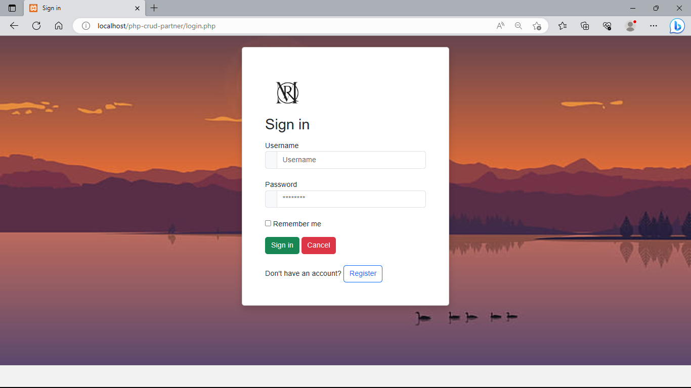
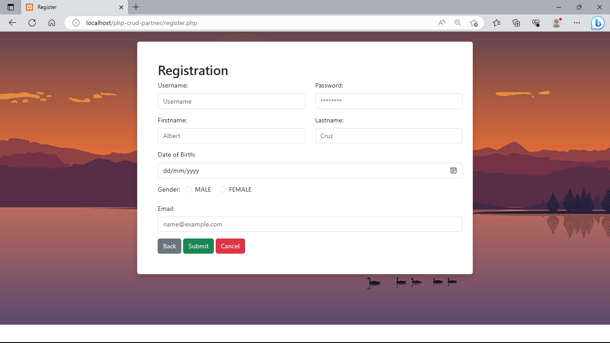
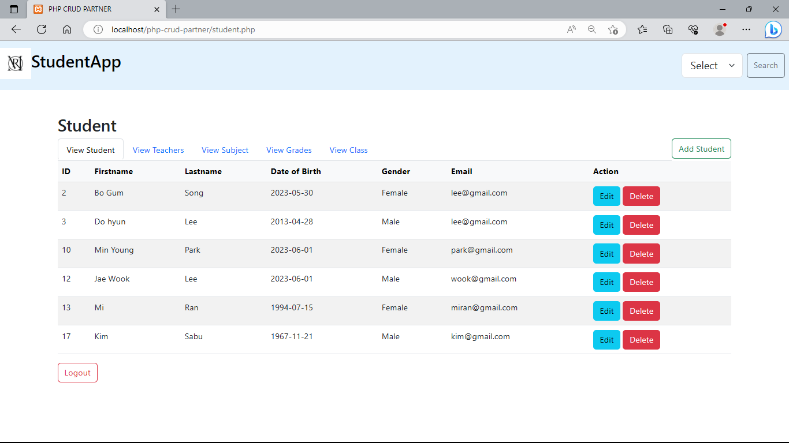
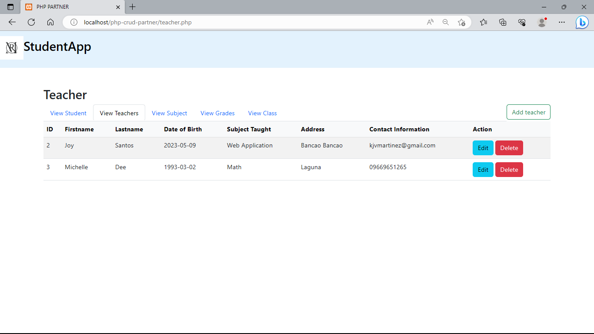
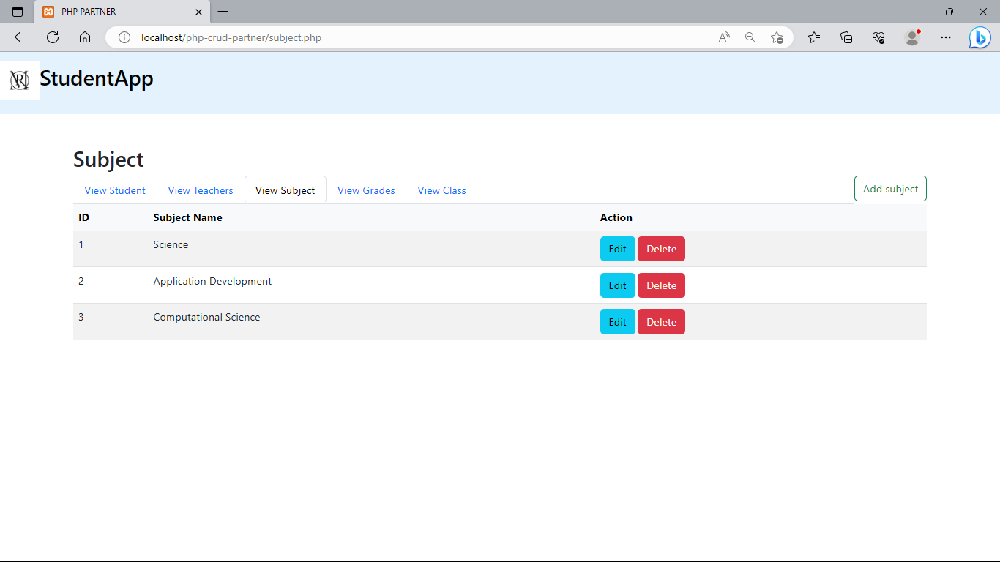
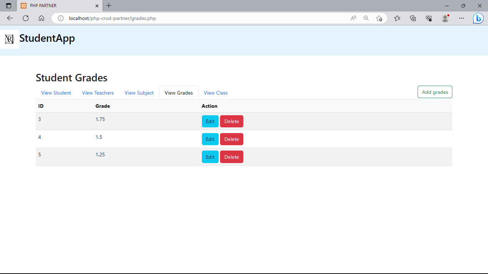
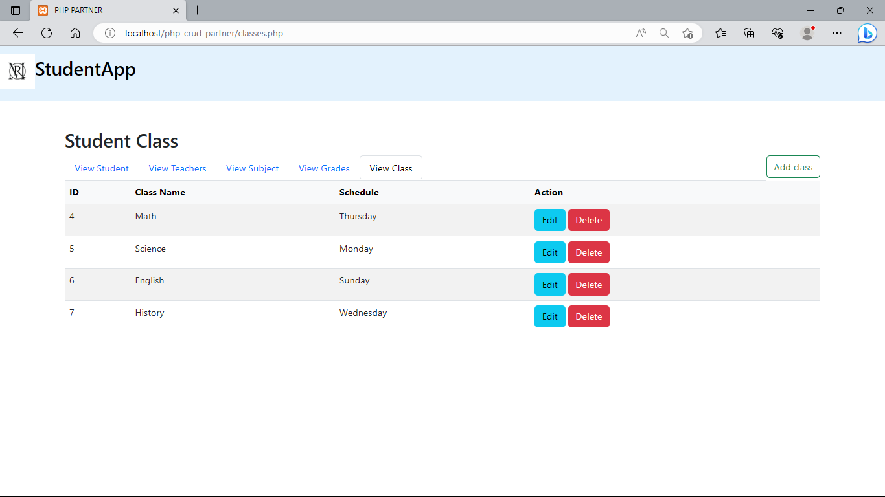
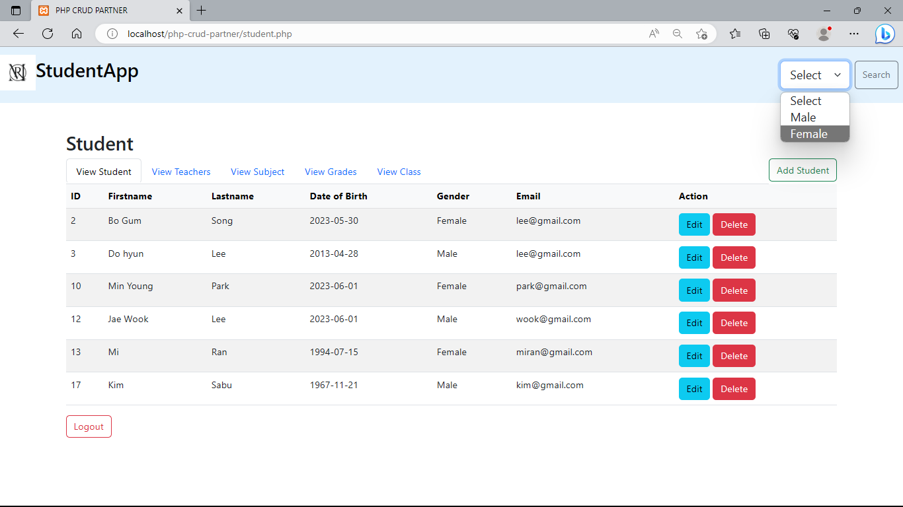

# Student Management Web Application

>
>
>

#### Name : Rose Jean Aban & Mark Christian Creador

#### Program/Blk: BSCS 3B1

##### PHP CRUD PARTNER

##### Description

The application has a responsive design that is user-friendly and straightforward, as well as an overall visual style. Using this web application, first you need to log in, and if the user doesn’t have account yet, they can click the register button to direct in main page of the web application. After creating an account, you can now interact, such as create, modify, view and delete records stored. The login page, registration form, student/teacher/class/grade management pages, and subject association are all highlighted in screenshots and pictures. 

CRUD, or Create, Read, Update, and Delete, is an abbreviation. The four fundamental operations that can be carried out on data in a web application or any other system that communicates with a database are represented by this.

###### Add
A system's Create action involves entering new data. This often entails gathering user input through forms or interfaces and saving it to a database in the context of a web application. Creating a new record in a student database, or a new user account are a few examples.

###### View
Reading from a system requires retrieving or displaying current data. It enables users to retrieve and examine previously produced content. For instance, you may display a list of students, get a user's individual information, or get a blog post from the database.

###### Edit/Update 
The Update process involves changing the system's current data. It enables users to modify or modify particular records or pieces of data. For instance, altering student grades, modifying a user's profile, or changing a blog post's content.

###### Delete
A system's existing data is removed or deleted as part of the Delete action. Users can delete any data or information they no longer require or find relevant. For instance, deleting a student from a class, or a user account.

###### Filter Gender: 
This functionality can filter the gender of the students in records. Users can filter if they want to see the female or male student’s records.

These four core CRUD actions including filtering serve as the foundation for interacting with data in web applications and are essential for managing and modifying data in databases. Many application features, including user management content management, and data manipulation, are built on them and are frequently utilized in database management systems.

##### Log in page
The user need to create log in first before directing to the data.

##### Register page
This will be the first step when the user don't have account yet, therefor user need to register before proceeding to the log in page.

##### View Student

##### View Teacher

##### View Subject

##### View Grades 

##### View Class 

##### Filter

